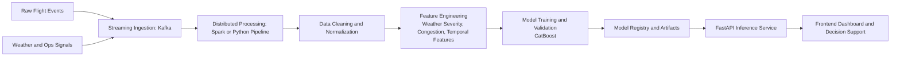
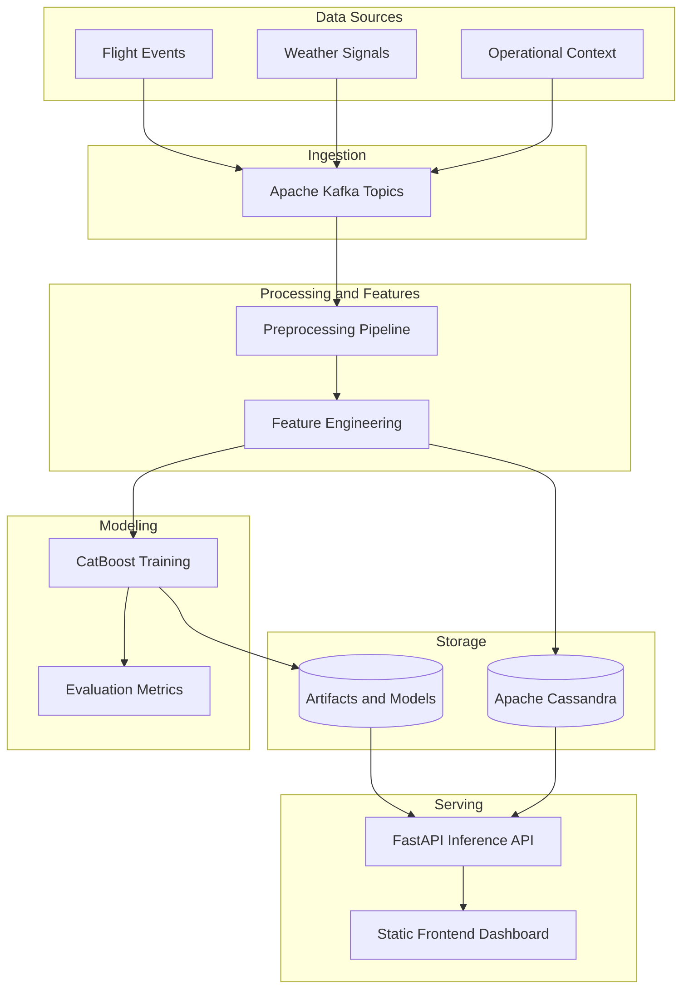
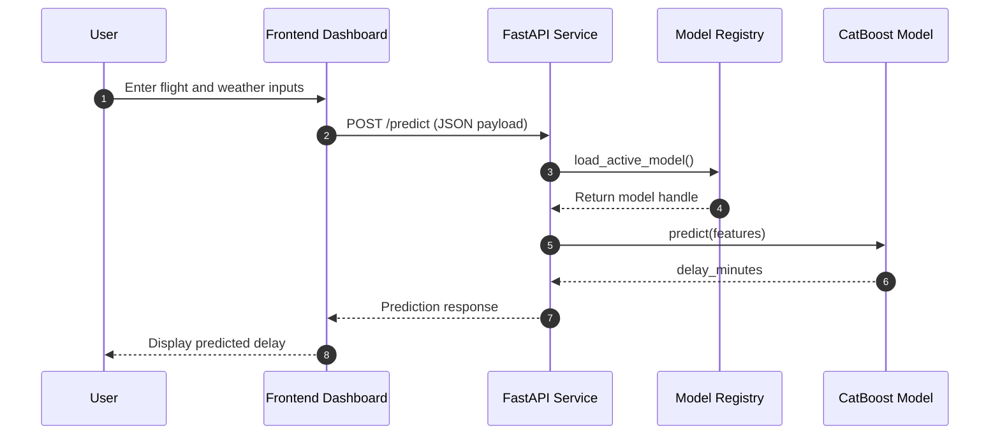

# Flight Delay Prediction Platform Report

## Introduction
Flight delays create large economic and operational losses for airlines, airports, and passengers. The main challenge is that delay behavior is influenced by multiple dynamic factors, including weather conditions, airport congestion, airline operations, and temporal demand patterns. A scalable machine learning system is required to process these factors at high volume and produce useful predictions in near real time.

This project proposes a big data and machine learning platform for flight delay prediction. The platform combines distributed data ingestion and processing, feature engineering, model training, and API-based inference. The final objective is to support more informed operational decisions and improve passenger experience by reducing uncertainty in flight schedules.

## Background and Related Work
Traditional delay prediction systems in aviation often rely on historical batch processing and static statistical methods. While these approaches provide some baseline insight, they are limited in fast-changing real-world environments where weather and traffic conditions shift continuously.

Common industry practice includes rule-based systems and classical machine learning models trained on isolated data sources. These methods often fail to integrate all relevant signals across operations, weather, and temporal patterns, which limits predictive accuracy and adaptability.

Recent research trends favor:
- Gradient-boosting models for strong tabular prediction performance.
- Hybrid data architectures that combine streaming ingestion and scalable storage.
- Feature-rich pipelines that include congestion indices, weather severity, and temporal context.

Based on these trends, this project adopts an integrated architecture with support for Apache Kafka, Apache Spark, Apache Cassandra, and ensemble machine learning methods, with CatBoost selected as the primary model candidate for tabular delay prediction.

### Background Workflow Diagram

The diagram summarizes the background-to-implementation flow used in this project, from multi-source data ingestion to trained-model serving and user-facing prediction output.

## Design
The system is designed as modular layers so components can scale independently.

### System Architecture Diagram

### 1. Ingestion Layer
Apache Kafka is used as the streaming backbone for high-volume event ingestion from flight, weather, and operational systems.

### 2. Processing Layer
Apache Spark is planned for distributed preprocessing and feature transformations. In the current local scaffold, preprocessing utilities are implemented in Python and can later be migrated or mirrored to Spark jobs.

### 3. Storage Layer
Apache Cassandra is selected for scalable, fault-tolerant persistence of raw events, processed records, and prediction outputs.

### 4. Machine Learning Layer
The ML layer includes dataset acquisition, data cleanup, feature preparation, training, and validation. CatBoost is selected as the preferred model for the current phase because:
- It performs strongly on mixed tabular data.
- It handles categorical features effectively.
- It offers reliable performance without excessive feature encoding complexity.

### 5. Serving Layer
A FastAPI application exposes:
- A health endpoint for service monitoring.
- A prediction endpoint for online inference.
- A static frontend dashboard for user input and result display.

### 6. End-to-End Data Flow
1. Events are ingested through Kafka.
2. Records are cleaned and normalized.
3. Features are generated and stored.
4. A model is trained and saved to artifacts.
5. The API loads the active model.
6. Frontend requests predictions and displays delay estimates.

## Separate Mermaid Diagram

## Implementation
The current implementation establishes a working scaffold and extends it with practical training pipeline components.

### Implemented Components
- Python backend service using FastAPI.
- Static frontend (HTML/CSS/JS) served by the backend.
- Preprocessing module for record cleaning and feature-row construction.
- CatBoost training module with metrics output and model persistence.
- Pipeline script for model training orchestration.
- Model registry logic that can load a trained model artifact when available and otherwise fallback to a baseline heuristic model.

### Dataset Handling and Preparation
The preprocessing pipeline includes dataset download and preparation logic, with focus on:
- Missing-value handling and type coercion.
- Temporal feature extraction (for example, month and day-of-week).
- Congestion proxy construction from grouped traffic counts.
- Weather severity signal construction.
- Final training frame generation with numeric and categorical inputs.

### Training Procedure
The training workflow performs:
1. Data loading and cleanup.
2. Feature-target split.
3. Train/validation split.
4. CatBoost regression training.
5. Evaluation using MAE and RMSE.
6. Model and metrics persistence to project artifact directories.

### Current Limitations
- External dataset URL reliability must be hardened with fallback sources or local mirrors.
- Spark-native preprocessing and Kafka/Cassandra runtime integration remain planned extensions.
- Additional evaluation (classification objective, calibration, drift monitoring) is pending.

### Next Steps
- Finalize a stable dataset source strategy (remote + local fallback).
- Add automated data validation checks before training.
- Expand feature engineering with route-level and historical lag features.
- Add experiment tracking and model versioning.
- Add automated tests for preprocessing and training pipelines.

## Conclusion
The project now has a solid architectural and implementation base for flight delay prediction, including a functional service layer and an extensible machine learning pipeline centered on CatBoost. With improved dataset reliability and full distributed integration, the system can evolve into a production-grade prediction platform suitable for large-scale aviation operations.
